# 🚀 ĐỒ ÁN PYTHON – GAME ASTRO PARTY

**Học viện Công nghệ Bưu chính Viễn thông – Cơ sở TP.HCM**  
**Ngành học**: Công nghệ thông tin – Lớp D22CQCN01-N  
**Thực hiện bởi**: Nguyễn Thanh Khai, Phạm Đăng Khôi, Phạm Tuấn Hưng

---

## 🎯 Mục tiêu dự án

Phát triển một trò chơi đa người chơi (2–4 người) với gameplay đơn giản nhưng hấp dẫn. Người chơi điều khiển máy bay để:
- Bắn hạ đối phương bằng nhiều loại vũ khí (đạn thường, laser, kiếm, bom)
- Tránh né các chướng ngại vật (chuồn chuồn, thiên thạch)
- Sử dụng kỹ năng tốc biến để di chuyển linh hoạt
- Tận dụng vật phẩm rơi trong game để tăng cường sức mạnh

---

## 🧠 Công nghệ sử dụng

- **Ngôn ngữ**: Python 3.x
- **Thư viện chính**: `pygame`
- **Âm thanh**: Phát và quản lý bằng `pygame.mixer`
- **Đồ họa**: Ảnh PNG động, Sprite-based animation
- **Kiến trúc code**: OOP (lập trình hướng đối tượng), chia module rõ ràng

---

## 👨‍💻 Thành viên & Phân công

| Họ tên             | Công việc chính                                        |
|--------------------|--------------------------------------------------------|
| Nguyễn Thanh Khai  | Điều khiển máy bay, xử lý vật cản                      |
| Phạm Tuấn Hưng     | Giao diện, âm thanh, vật cản, hiệu ứng                 |
| Phạm Đăng Khôi     | Vũ khí, xử lý va chạm                                  |

📺 **Video demo**: [YouTube](https://youtu.be/G8xf9Aszqgg?si=oWytsqU3B2Zcm88L)

---

## ⚙️ Hướng dẫn cài đặt

1. **Yêu cầu hệ thống**:
   - Python 3.8+
   - Hệ điều hành Windows / Linux / macOS

2. **Cài đặt thư viện cần thiết**:
   ```bash
   pip install pygame
   ```

3. **Chạy game**:
   ```bash
   python main.py
   ```

4. **Cấu trúc thư mục đề xuất**:
   ```
   AstroParty/
   ├── main.py
   ├── image/
   │   ├── [các file ảnh .png, .jpeg]
   ├── sound/
   │   ├── [các file âm thanh .mp3, .wav]
   ├── README.md
   └── ...
   ```

---

## 🎮 Hướng dẫn chơi

- **Số người chơi**: 2 đến 4 người
- **Điều khiển**:
  - Mỗi người chơi sử dụng tổ hợp phím riêng để:
    - Xoay máy bay
    - Tấn công
    - Tốc biến (nhấn nhanh 2 lần phím xoay)

- **Mục tiêu**:
  - Loại bỏ các người chơi khác
  - Tránh va chạm quái vật hoặc bị đối phương tấn công
  - Sử dụng vật phẩm để nhận kỹ năng đặc biệt

- **Vũ khí**:
  - Đạn thường: bắn liên tục
  - Laser: tia năng lượng mạnh
  - Kiếm: quả cầu xoay quanh máy bay
  - Bom: phát nổ gây sát thương diện rộng

---

## 🖼️ Hình ảnh minh họa

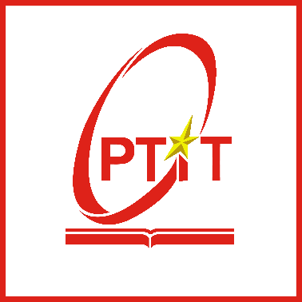
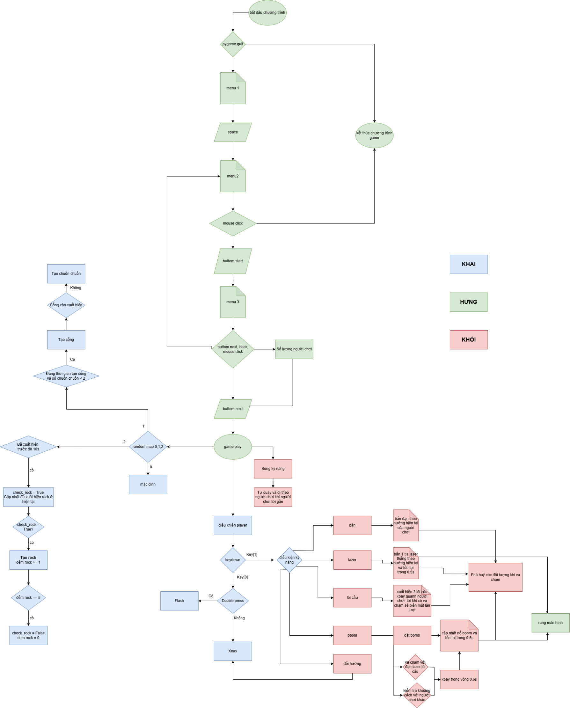

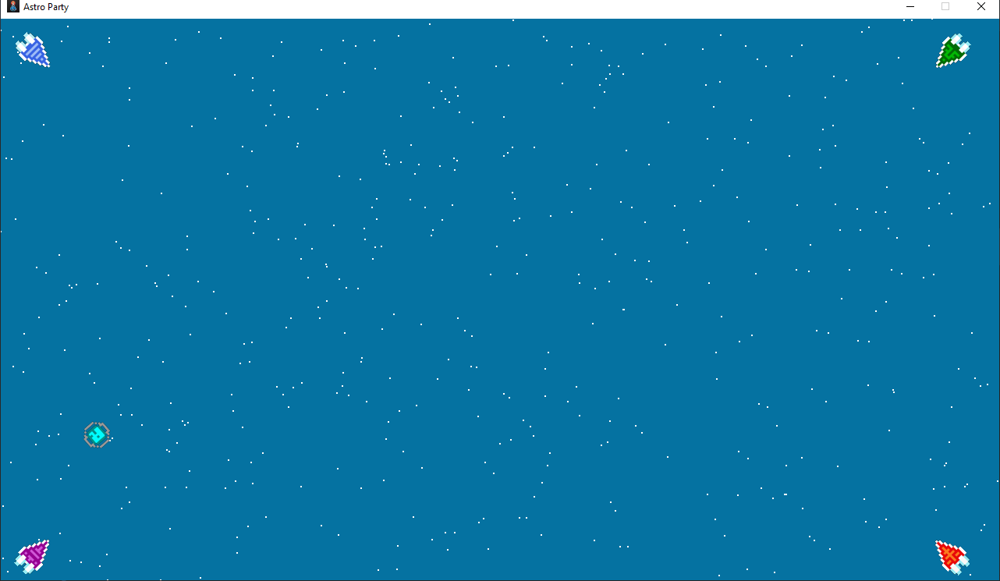

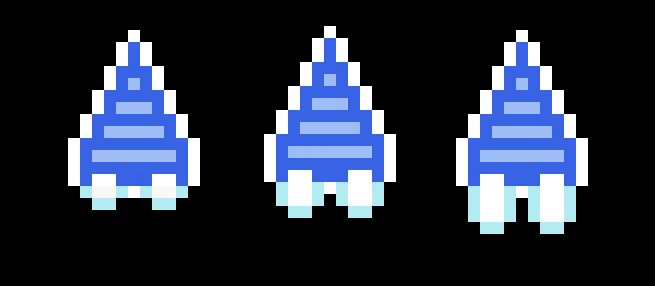


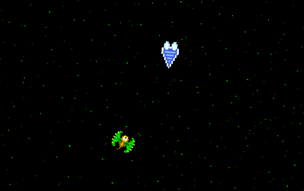

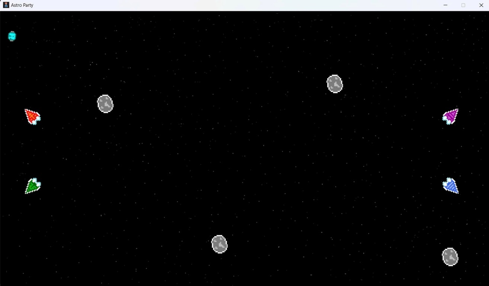

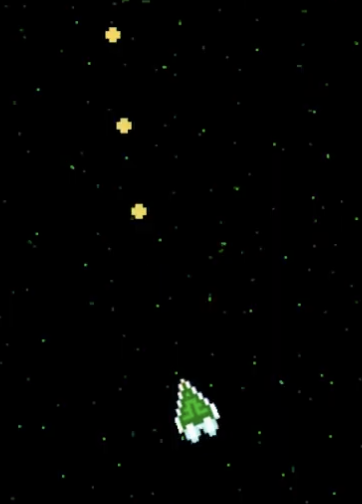


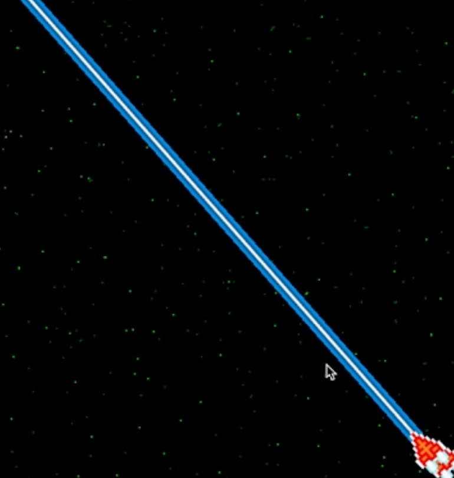


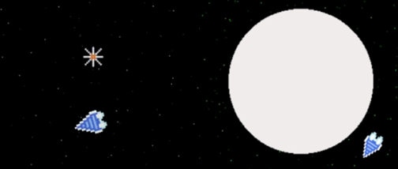


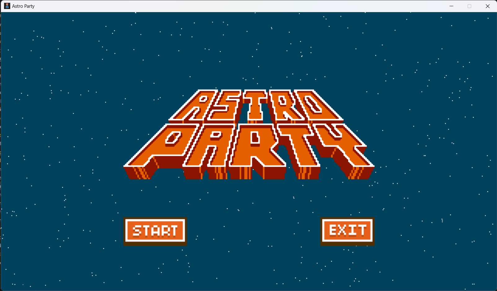
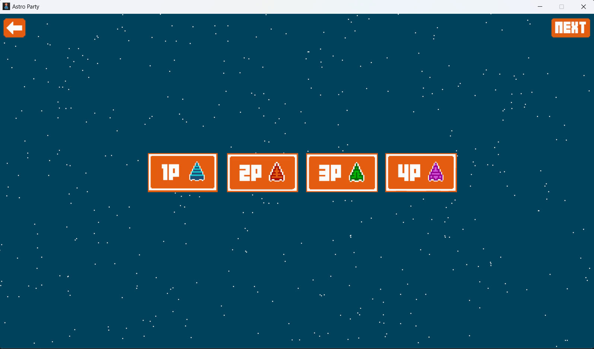
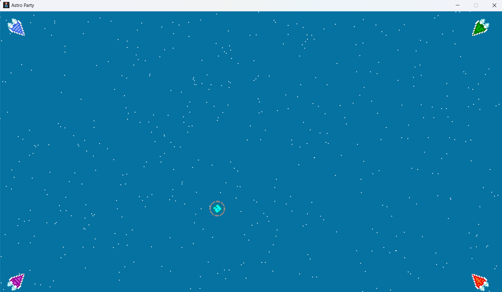
